# General Config

In this section within Cymmetri, a range of general or broad configuration settings and options are managed. These settings encompass various foundational configurations that affect the overall behavior of Cymmetri.

<figure><figcaption></figcaption></figure>

There are different system configurations in Cymmetri mentioned below:

#### Time Based&#x20;

In the Time-Based configuration, system administrators can determine whether the system will send repeated notifications to users based on the number of days remaining, as specified in the 'Send Notifications before' field. This occurs when an application is assigned to the user as a time-based application and is about to expire.

<figure><figcaption>
Time Based Config 
</figcaption></figure>

#### Email Config

These settings and configurations within Cymmetri are specifically related to the management and customization of email-related functionalities. This configuration area allows administrators to set up, manage, and customize the email communications as per the organization's needs.

<figure><figcaption>
Email Config 
</figcaption></figure>

**Archive Config**

Within the Archive Config section, administrators have the ability to determine the duration a user remains suspended before transitioning to the archived users' section. This can be specified using the "Archive After" setting.

<figure>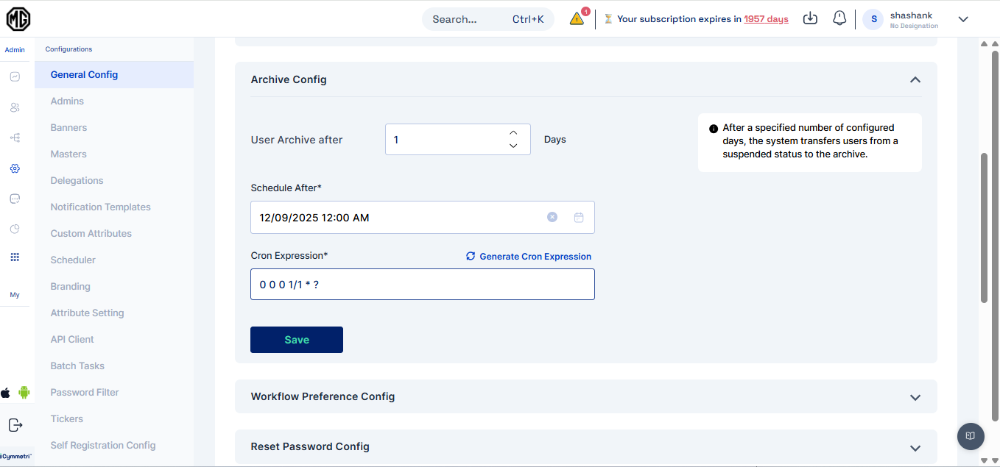<figcaption></figcaption></figure>

#### **Scheduler Integration:**

The system incorporates a scheduler feature, enabling administrators to automate the transition of users from the suspended state to the archived state. The scheduler runs within defined time frames, streamlining the management of user statuses.

As an example, if the "User Archive After" configuration is set to 0 days, a user will promptly move to the archived users section upon suspension, and if it is set to a higher number it will wait for the configured number of days before moving the user to archive. This allows for flexibility in tailoring user management to specific organizational needs.

<figure><figcaption></figcaption></figure>

#### Workflow Preference Config&#x20;

Within the Workflow Preference Config, administrators have the ability to specify the visibility and editability of workflows associated with user access requests for a particular application. This setting allows for tailored control over how approvers interact with the configured workflow.

#### **Visible to the User:**

When this option is selected, approvers for the requested application are visible to the user initiating the access request. Transparency is maintained throughout the workflow process.&#x20;

#### **Hidden from the User:**

Opting for this configuration ensures that approvers for the requested application remain hidden from the user. The workflow operates discreetly in the background without user visibility.&#x20;

#### **Editable by the User:**

If this preference is chosen, users initiating access requests have the ability to select approvers based on their availability, providing a more dynamic and user-centric workflow experience.&#x20;

This functionality applies if a workflow has been configured for the specified application, offering flexibility in managing user access requests in alignment with organizational requirements.

<figure><figcaption></figcaption></figure>

The approvers mapped in the workflow can only be edited only if they are part of the "user list"  in workflow configurations.&#x20;

<figure><figcaption></figcaption></figure>

In conclusion, if the workflow preference config is set to Editable, the requester will only be able to select the approver from the workflow if the approvers are part of a user list.

#### Reset Password Config:

The administrators have a centralized control panel to define how a user's manager can perform password resets. This feature streamlines the process while ensuring security and flexibility.

<figure>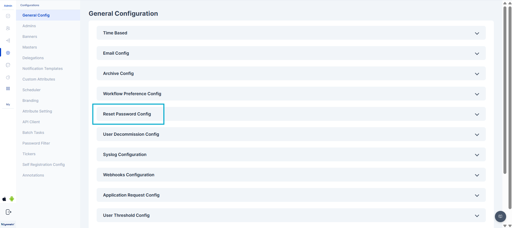<figcaption></figcaption></figure>

The administrator has three distinct options for configuring the password reset process, allowing them to choose a method that best fits the organization's security policies and workflow.

<figure><figcaption></figcaption></figure>

* **Generate Password**: This option allows the user's manager to generate a random, one-time password. The manager must then securely communicate this password to the end-user, who is required to use it for their next login and change it to a new, permanent password immediately. This method ensures that the manager does not have access to the user's long-term password.
* **Generate Password and Send to User's Email**: With this option, the manager triggers the password reset, and the system automatically generates a new password and sends it directly to the user's registered email address. This eliminates the need for the manager to manually transmit the password, reducing the risk of human error and improving efficiency.
* **Send Reset Password Link to User's Email**: This is the most secure option. The manager initiates the process, but instead of a password, the system sends a secure, time-sensitive "Reset Password" link to the user's email. The user must click the link to create a new password, ensuring that only they have access to their account and that the process is compliant with modern security best practices.

To add a layer of security and prevent unauthorized password resets, administrators can enable the "OTP required" setting. When this is activated, a one-time password (OTP) is sent to the user's registered mobile number before the password reset can be finalized. This ensures that the user is the legitimate owner of the account before any password changes are applied, guaranteeing that only the right person's password is being reset.

For understanding how the admin resets the password, refer to [User Details](../../identity-hub/managing-users-and-groups/user-detail.md#reset-password).

#### **User Decommission Config**&#x20;

<figure><figcaption>
User Decommission Config 
</figcaption></figure>

The User Decommission Config is a vital feature in Cymmetri, allowing administrators to automate user decommissioning based on login activity.&#x20;

In this configuration, actions are triggered  if the user hasn't logged in to Cymmetri in N number of days

**Config Days**: Set the threshold for user inactivity in terms of days. Users who have not logged in for the specified duration will be subject to the defined actions.

**Actions**: Choose from three distinct actions to be taken when the specified inactivity threshold is reached:&#x20;

* None: No action will be taken based on user inactivity.
* Inactive: Users exceeding the configured inactivity period will be marked as inactive.&#x20;
* Delete: Users who have not logged in for the specified duration will be suspended from the system.

#### **Syslog Configuration**

<figure><figcaption>
Syslog Configuration
</figcaption></figure>

Syslog configuration in Cymmetri allows for the seamless integration of logging and event information with external Syslog servers. By defining specific parameters, administrators can ensure that critical system events, user access information, and other relevant data are transmitted in real-time to a Syslog server.

**Syslog Config fields:**

1. Syslog Name - Assign a unique name to this Syslog configuration
2. App Name - Specify the application name associated with this Syslog configuration.
3. Server Host Name - Enter the hostname or IP address of the Syslog server that will receive log messages
4. Server port - Define the port number on the Syslog server where log messages will be sent.
5. Protocol - Choose the preferred protocol for Syslog communication - TCP or UDP.

In configuring these parameters, administrators tailor Cymmetri's interaction with external Syslog servers, optimizing the logging process to meet organizational needs.

#### **Webhooks Configuration**

Webhooks in Cymmetri's admin module provide a powerful mechanism for real-time communication and integration with external applications or services. Administrators can configure various webhook settings to enhance the system's functionality and streamline interactions with external components.

<figure><figcaption>
Webhooks Configuration
</figcaption></figure>

#### **Webhook Configs:**

1. Protocol - Communication protocol - (Static field)
2. Method - HTTP method for webhook requests - (Static Set to post)
3. Server - Enter the server or endpoint URL where the webhook payloads will be delivered.
4. Server Context path - provide the context path for the specific service within the server.
5. Secret - This secret key, known to both Cymmetri and the external service, helps authenticate the webhook requests.
6. Token Expiry Minutes - Define the duration (in minutes) for which authentication tokens associated with webhook requests are valid.

#### **Application Request Config**

This setting determines if a user can initiate requests for new applications through the Cymmetri self-service page.&#x20;

When the status is active, the user will see the "Add New" button on the "My Access" page within the "My Workspace" section. By clicking this button, the user can submit an access request for additional applications.

<figure><figcaption>
Application Request Config 
</figcaption></figure>

#### User Threshold Config:

The User Threshold Config in Cymmetri primarily includes three key functions — Create Count, Update Count, Delete Count, and Send threshold notifications to. These define the maximum number of user creation, modification, and deletion operations permitted within the system in a single day, ensuring controlled provisioning and preventing unintended bulk changes.

<figure>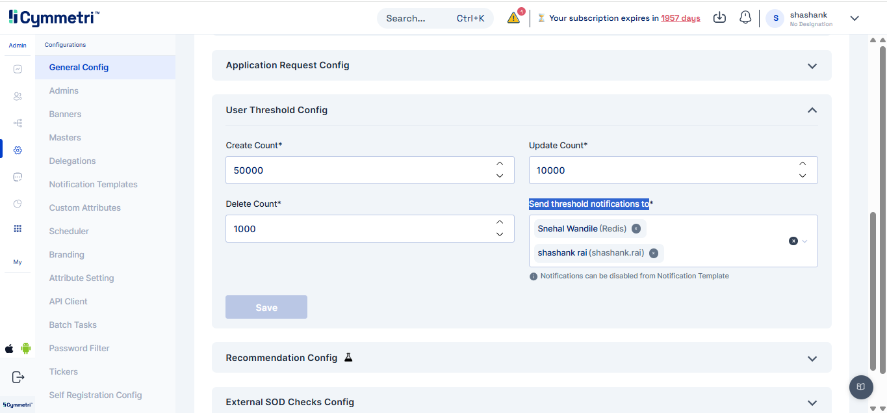<figcaption></figcaption></figure>

**Create Count**: Sets the maximum number of new user accounts that can be generated.

<figure>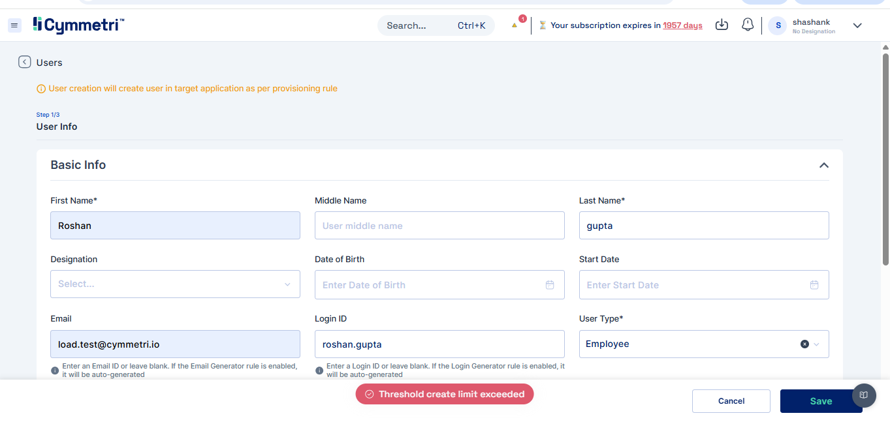<figcaption></figcaption></figure>

**Update Count**: Defines the upper limit for modifications or changes to existing user profiles.

<figure>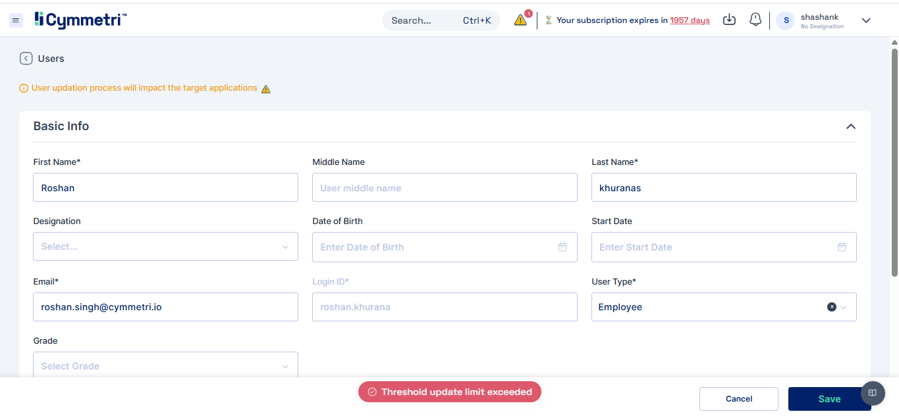<figcaption></figcaption></figure>

**Delete Count**:  Establishes the cap on how many user accounts can be removed.

<figure>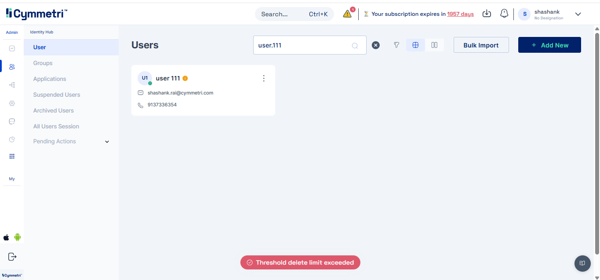<figcaption></figcaption></figure>

**Threshold Notifications**: You can configure who should be notified when the threshold is exceeded. Notification will be sent via email.

<figure>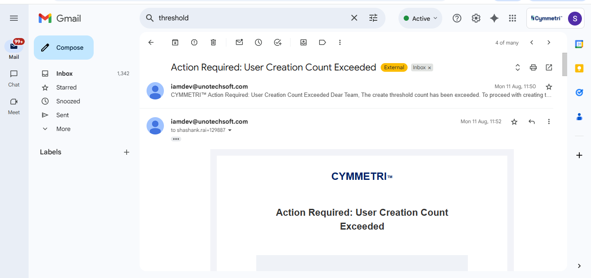<figcaption></figcaption></figure>

#### Recommendation Config:

The recommendation configuration defines how the engine generates, manages, and displays application or role suggestions for users during campaigns and workflows. It ensures recommendations are personalized using user attributes, access history, and peer behavior, while maintaining compliance through segregation of duties checks. The configuration also allows dynamic recalculation of scores when user data changes, provides flexibility to enable or disable recommendations with corresponding updates in the UI and history, supports multiple tenants, and retains recommendation history for reporting even if recommendations are later disabled.\
\
1\. **Recommendation Engine in Campaign:**

<figure>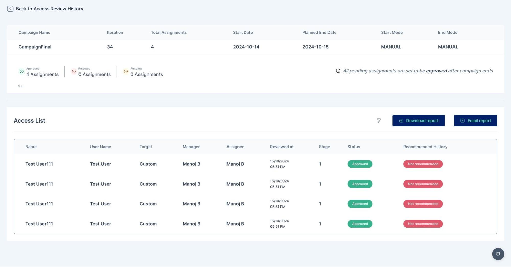<figcaption></figcaption></figure>

<figure>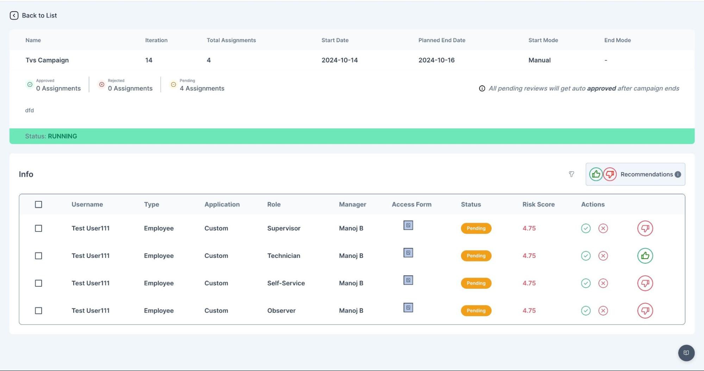<figcaption></figcaption></figure>

2. **Recommendation Engine in Approver Inbox:**

<figure>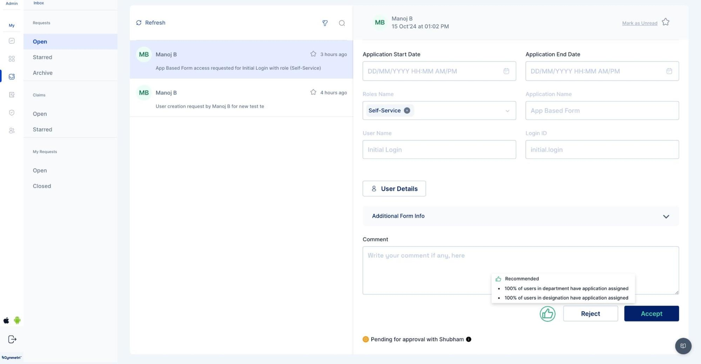<figcaption></figcaption></figure>

#### External SOD Checks Config:

The External SoD Checks Config enables configuration of segregation-of-duties checks, webhook connections, and workflows to detect, notify, and manage access violations during application assignments. The Webhooks Config in Cymmetri’s External SoD Service is used to establish connections with external systems or services. It allows the platform to send real-time event notifications (such as SoD violations or workflow triggers) to defined webhook endpoints. When All Applications is selected, External SoD checks will run for every application, except those explicitly listed in the Excluded section, which will be ignored during violation detection.

<figure>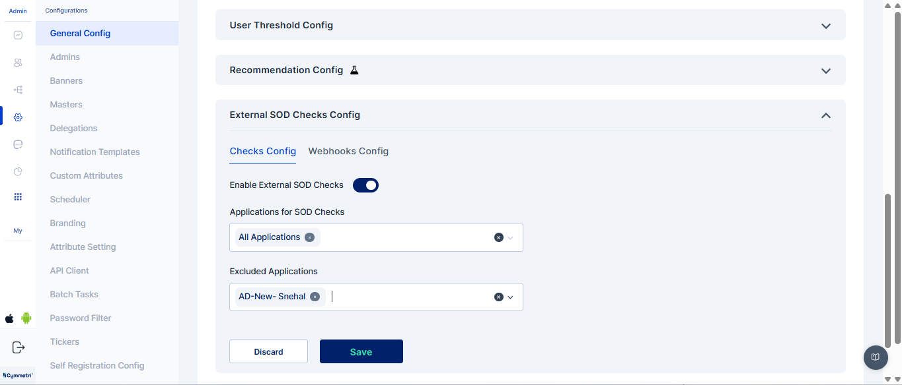<figcaption></figcaption></figure>

<figure>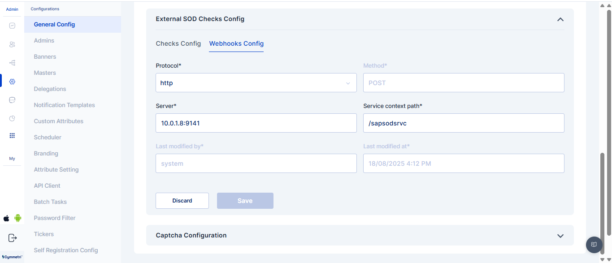<figcaption></figcaption></figure>

**Application Assignment with role during External SOD Checks**: When a user is assigned an application along with a specific role, the system evaluates the assignment against configured External SoD rules.

<figure>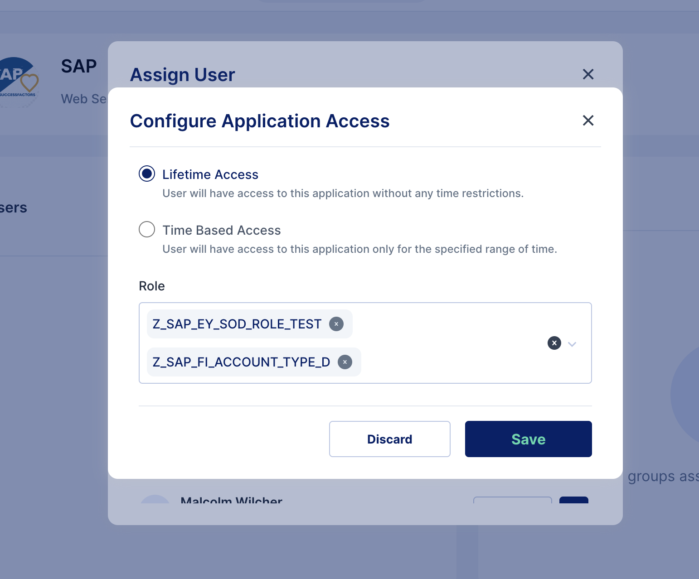<figcaption></figcaption></figure>

**Multiple SOD Violations Detected**: It indicates that a user’s application or role assignment has triggered more than one segregation-of-duties conflict, all of which are captured and sent for review through the workflow process.

<figure>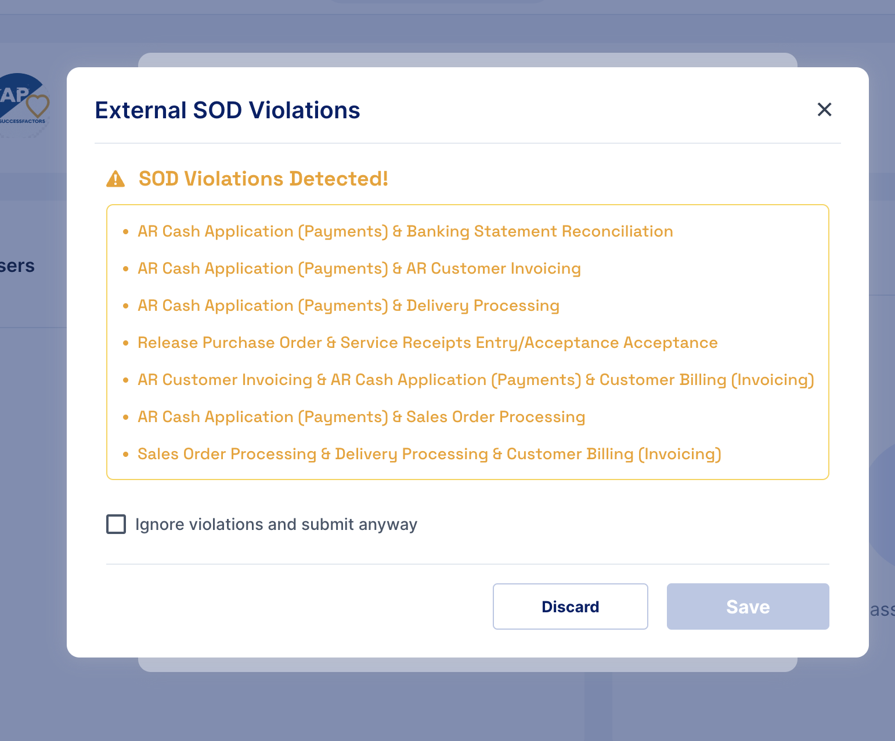<figcaption></figcaption></figure>

**Inbox Violations**: Segregation-of-duties conflicts detected during application or role assignments, which are delivered to the user’s or approver’s inbox for review and necessary action.

<figure>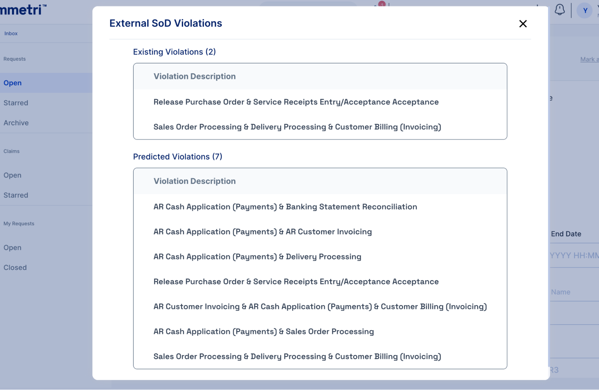<figcaption></figcaption></figure>

**Workflow Approver View**: It is the interface where approvers can review, approve, or reject access requests that have triggered segregation-of-duties violations, ensuring proper compliance before access is granted.

<figure><figcaption></figcaption></figure>

#### Captcha Configuration

This integrated advanced CAPTCHA validation capabilities bolsters the security against automated threats and bot-based attacks. The platform now supports two distinct methods, providing administrators with a flexible approach to securing user interactions.

#### Supported CAPTCHA Methods

* **hCaptcha**: This method is a privacy-focused and widely adopted alternative to traditional CAPTCHA. It requires users to perform a simple task (e.g., identifying objects in an image) to prove they are human, effectively blocking bots while maintaining user privacy.
* **Traditional CAPTCHA**: This classic method uses distorted text or numbers that users must correctly enter. While this method is effective, it can sometimes be more challenging for users to solve.

These integrations enable Cymmetri to enhance its security posture by providing a robust defense layer, ensuring that user registration and login processes are protected from malicious automated activity.

<figure><figcaption></figcaption></figure>

From this menu, the administrator has two options:

1. **hCaptcha Type**: Selecting this option enables hCaptcha validation, which utilizes simple, interactive tasks for user verification.
2. **Traditional CAPTCHA**: Choosing this option will implement the classic method of using distorted text.

<figure><figcaption></figcaption></figure>

The administrator can then save the configuration. Below is an example of what the traditional CAPTCHA looks like to an end-user.

<figure><figcaption></figcaption></figure>
