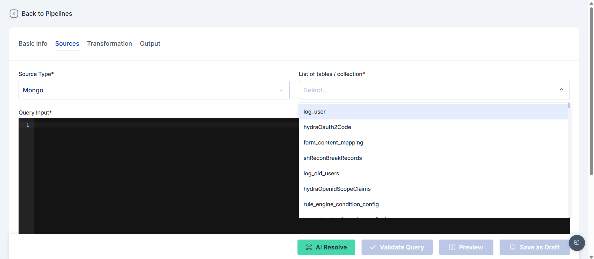
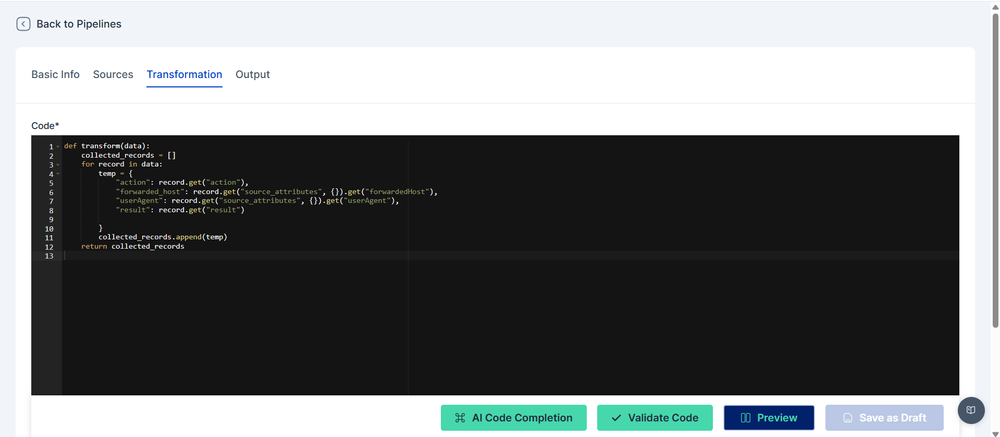

# Pipeline

A data pipeline is an automated system designed to facilitate the extraction, transformation, and loading (ETL) of data, which is essential for reporting and analytical processes. The pipeline's primary function is to serve as a data flattening tool, converting complex, nested data structures into a unified, two-dimensional format suitable for analysis.

The data pipeline can be configured and managed through the following menu path:

**Insights → Pipeline Flow → Pipeline Listing**

<figure><figcaption></figcaption></figure>

The Cymmetri data pipeline supports the following data movements:

* MongoDB to ClickHouse: This allows for the efficient transfer and transformation of data from a flexible NoSQL database to a high-performance, columnar database optimized for analytics.
* ClickHouse to ClickHouse: This capability enables in-place data processing and refinement, such as combining data from different tables or performing complex aggregations within the same ClickHouse environment.

The processed data is ultimately stored in ClickHouse, a decision that ensures reliability, scalability, and immediate user accessibility for reporting and analysis. The standardized, flattened data can then be leveraged for various reporting needs.

The Pipeline Listing provides a centralized view of all pipelines created by the administrator. A new pipeline can be created by selecting the "+ Add New" button. The listing provides a generic overview of each pipeline, including:

* Name: The user-defined name of the pipeline.
* Table Name: The destination table where the processed data will be stored.
* Created At: The date the pipeline was created.
* Status: The current status of the pipeline, either Active or Inactive.
* Execution Status: The state of the pipeline, indicating if it is a Draft or has been Published.

From this list, administrators can perform several actions, including Schedule, Publish, Edit, and Delete a pipeline.

<figure><figcaption></figcaption></figure>

To create a new pipeline, administrators must configure four key sections: Basic Info, Sources, Transformation, and Output.

**Step 1: Basic Info**

* Flow Name: A unique and descriptive name for the pipeline flow.
* Flow Description: A brief explanation of the pipeline's purpose for future reference.

<figure><figcaption></figcaption></figure>

<figure><figcaption></figcaption></figure>

<figure><figcaption></figcaption></figure>

**Step 2: Sources**

This step in the data pipeline configuration is crucial for defining where the data will be extracted from. Administrators must specify the data source, the target tables, and the query that will be used to pull the data.

1. Select Source Type: The administrator must choose the source database for data extraction, with options including MongoDB or ClickHouse.
2. Choose Target Tables/Collections: This action enables administrators to select specific tables or collections. This step is useful for understanding the table's structure and obtaining sample data, which helps in formulating the correct query.
3. Formulate the Query: The administrator writes a query to define the exact data to be pulled from the selected source. To streamline this process, Cymmetri provides three tools:
4. AI Resolve: This tool assists the administrator in writing or refining the query by offering AI-powered suggestions and assistance.
5. Validate Query: This feature ensures the query is syntactically correct before execution, preventing errors and saving time.
6. Preview: Once the query is validated, this tool allows the administrator to view a sample of the data that will be extracted. This provides a final check to ensure the query is pulling the intended data.

After completing these steps, the administrator can save their work as a draft to continue the configuration process later.

<figure><figcaption></figcaption></figure>

**Step 3: Transformation**

The Transformation step is where the data is converted into a unified, flattened format. The administrator writes the necessary code or queries to perform these transformations. This process is also supported by the AI Resolve, Validate Query, and Preview tools. The administrator can save their work as a draft.

<figure><figcaption></figcaption></figure>

**Step 4: Output**

This final step in the data pipeline configuration is crucial for defining where the processed, flattened data will be stored. The administrator specifies the destination table within ClickHouse. The system also allows the administrator to edit the previewed query from previous steps, providing a final opportunity to refine the data before it is loaded.

<figure><figcaption></figcaption></figure>

Key Updates:

* Table Name Validation: The system ensures that the destination table name cannot be a duplicate of an existing table.
* Dynamic Schema Updates: A key enhancement is that if the administrator goes back and changes the query and transformation, the destination table structure is automatically updated, and the create query is changed accordingly. This dynamic capability ensures data consistency and reduces the risk of schema mismatches.
