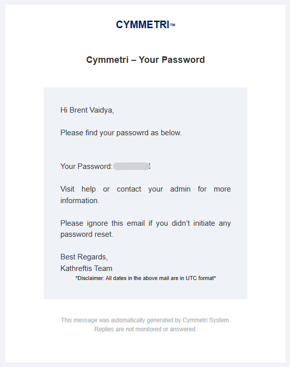
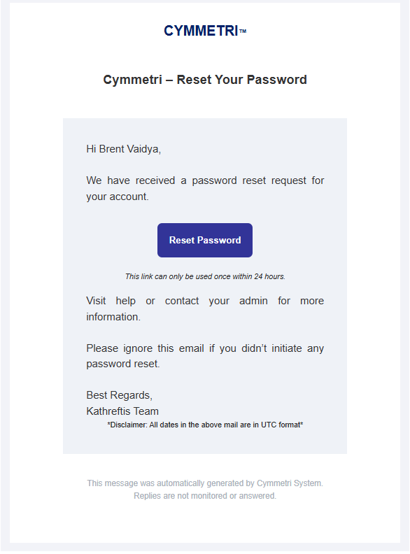

# User Detail

This page is designed to provide a comprehensive view of an individual user's information, facilitating easy access and management for administrators.

## User Profile Overview

The top section of the User Details Page showcases the following crucial user information:

<figure><figcaption></figcaption></figure>

#### Profile Picture

The user's profile picture is prominently displayed, offering a visual identification of the user. This feature aids in personalizing the user experience and making navigation more intuitive.

#### User's Status

Right next to the profile picture, users can find the current status of the user, which indicates whether the user is Active, Inactive, or Pending. This status helps in quickly understanding the user's engagement level.

#### Login ID

This is a unique identifier for the user within the system. It serves as a key piece of information for various administrative processes, including user tracking, support, and security checks.

#### Email ID

The user's Email ID is displayed, providing an essential communication link. It is used for sending notifications, password resets, and other critical communications.

#### Mobile Number

The user's mobile number is listed if provided. This number can be utilized for two-factor authentication, urgent alerts, or direct contact purposes.

This structured format ensures that an administrator or any authorized viewer can quickly access and understand a user's essential information without navigating through multiple pages.

#### **Risk Details**

The user's risk details are visible on the page to notify that the user is a high-risk user. On further clicking on that page, it shows the User's Risk metrics.

<figure><figcaption></figcaption></figure>

## User Info Page

This page provides a comprehensive overview of the user information managed within our system. The data is categorized into several sections to facilitate easy access and understanding of each user's profile. These sections are detailed below.

<figure><figcaption></figcaption></figure>

#### Basic Information

* **First Name**: The user's given name.
* **Middle Name**: The user's middle name, if applicable.
* **Last Name**: The user's family name.
* **Grade**: The user's grade (a set of values needs to be defined for this field in the Masters).
* **Designation**: The specific title or position the user holds.
* **Date of Birth**: The user's birth date.
* **Age**: The user's current age is calculated from the date of birth.
* **User Type**: Classification of the user based on the user types defined in the system.
* **Login ID**: The unique identifier used by the user to access the system.

#### Contact Information

* **Country**: The country where the user is located.
* **City**: The city within the country.
* **Mobile**: The user's mobile phone number.
* **Email**: The user's email address is used for electronic correspondence.
* **Landline**: The user's landline phone number, if applicable.
* **Address**: The user's full postal address.

#### Organization Information

* **Employee ID**: A unique identifier assigned to the user within the organization.
* **Department**: The department to which the user is assigned.
* **Start Date**: The date when the user commenced their current position.
* **End Date**: If applicable, the date when the user's current position will or has ended.
* **Manager**: The user's direct supervisor or manager.

#### Custom Attributes

Additionally, this page may display values for custom attributes specific to our organization. These attributes allow for the capture of information not covered by the standard categories but deemed necessary for our operations.

This comprehensive user information page ensures that all pertinent data regarding an individual within our organization is readily accessible, facilitating smooth operations, management decisions, and communication.

## Applications Page

This page is designed to streamline the management and assignment process of applications for users. It offers a section where you can easily view all your assigned applications along with their current status. Additionally, it allows for the straightforward assignment of new applications to your profile.

<figure><figcaption></figcaption></figure>

* **Viewing Assigned Applications:** Upon accessing the page, you will be presented with a list of applications currently assigned to you. Each application tile gives a snapshot of the application's status, enabling you to quickly assess which applications require your attention.
*   **Assigning Roles:** Application Roles can be assigned to the user using the Assign Role option. This option also allows the assignment of multiple roles to a user.

    <figure><figcaption></figcaption></figure>
*   &#x20;**Unassign Assigned Applications:** Assigned applications can be removed using the delete option in the (⋮) menu.

    <figure><figcaption></figcaption></figure>

* **Assigning New Applications:** Should you need to add more applications to your list, the process is simple. Just click on the **Add New Button** located on the interface. This action opens up a selection window where you can choose additional applications that you wish to assign to the user.

<figure><figcaption></figcaption></figure>

* **Searching for Applications:** To facilitate ease of access, a search function is incorporated into the interface. This feature allows you to quickly find specific applications by typing the name or part of it into the search bar, saving you time and effort from manually scrolling through the list of applications.

<figure><figcaption></figcaption></figure>

**Note:** _In instances where an application has not been successfully assigned, the interface provides direct actions to resolve the issue without needing to navigate away from the page. Each application tile includes an (_⋮) _menu with two options:_

* _**Retry:** If an application's assignment process encounters an issue, you can select this option to attempt assigning the application again._
* _**Delete:** If the assignment issue remains unresolved or if you no longer wish to keep the application, you can choose to remove the application from your list entirely._

## **Groups Page**

This page provides an overview of the groups to which a user is assigned, reflecting the current status of each.&#x20;

<figure><figcaption></figcaption></figure>

#### Viewing Assigned Groups and Their Status

Upon accessing the page, users are presented with a list of all the groups to which they are currently assigned. Each entry includes the **group's name, description**, **number of users in the group** and **number of applications assigned to the group**.

#### Adding New Groups

To enhance the user's role or access within the system, the **Add New Button** is prominently positioned. This option allows users to be added to more groups, expanding their access and functionalities within the application. The process is designed to be straightforward, guiding the user through a simple process to ensure accurate group assignments.

#### Editing Group&#x20;

This menu option, found within the ellipse (⋮) menu, takes you to the groups pag,e where you may edit any information related to the group

#### Removing Group Memberships

Equally important is the capacity to manage the departure from groups, which is facilitated by the Delete Group option. Also found within the ellipse (⋮) menu, this feature does not delete the group itself but rather unassigns the user from the selected group. This action ensures the user's access and permissions within the application are precisely tailored, maintaining security and relevance.

## &#x20;User Activity Log Page

This page shows the user-specific audit log for all the various actions and activities performed by the user. This may include all activities related to the user, as shown below

<figure><figcaption></figcaption></figure>

## User's  Settings Page

**Status:**

You can change the status of users and accounts in our system to manage access and control.

#### For Users:

* **Locked**: Stops user access temporarily. This is used for security reasons or if there are too many failed login attempts.
* **Unlocked**: Gives access back to the user, allowing them to log in and use the system.

#### For Accounts:

* **Active**: The account is in use, and everything works normally.
* **Inactive**: Temporarily not in use, but can be activated again.
* **Delete**: The account is deleted and moved to suspended accounts

<figure><figcaption></figcaption></figure>

#### **Reset Password**

The administrator has three distinct options for configuring the password reset process, allowing them to choose a method that best fits the organization's security policies and workflow.

1. **Generate Password**: This option allows the user's manager to generate a random, one-time password.&#x20;
2. **Generate Password and Send to User's Email**: With this option, the manager triggers the password reset, and the system automatically generates a new password and sends it directly to the user's registered email address.&#x20;
3.  **Send Reset Password Link to User's Email**: This is the most secure option. The manager initiates the process, but instead of a password, the system sends a secure, time-sensitive "Reset Password" link to the user's email. The user must click the link to create a new password.

    <figure><figcaption></figcaption></figure>

**Generate Password**

<figure><figcaption></figcaption></figure>

**Generate Password and Send to Users' Email**

<figure><figcaption></figcaption></figure>

<figure><figcaption></figcaption></figure>

<figure><figcaption></figcaption></figure>

**Send Reset Password link to Users Email**

<figure><figcaption></figcaption></figure>

<figure><figcaption></figcaption></figure>

<figure><figcaption></figcaption></figure>

#### **RBAC**

This section can be used to assign tenant-wide roles defined in the master to the user.

<figure><figcaption></figcaption></figure>

**Secret Questions**

This section shows a list of secret questions selected by the user

<figure><figcaption></figcaption></figure>

**Additional MFA**

Administrators can view the MFA mechanisms configured by the user, as well as remove the configured MFA if required for a specific user

<figure><figcaption></figcaption></figure>

### Trusted Devices by User

If Adaptive MFA is configured for users and a configuration for  Device Trust is done, Cymmetri maintains a list of Trusted devices that satisfy the conditions of the Device Trust configuration. This list of devices trusted based on the configuration done by the admin is listed on this page with the following information about each device: **Browser**, **OS**, **Created At**, **Trusted**, **Action**(remove device)

<figure><figcaption></figcaption></figure>

### User's Sessions

This page provides Cymmetri administrators with the capability to monitor and manage all user sessions. It provides the following information: Browser, OS, Created By, IP Address, Created At, and Action (delete session). A user may have multiple session entries if the Multiple Session configuration is enabled.

<figure><figcaption></figcaption></figure>

### Managed View

The Managed View page shows the user data based on various provisioning applications assigned to a user. This page shows the **Attribute Name, Managed System Value,** and **IDM Value**&#x20;

* **Attribute Name:** Attribute name as defined in the policy attribute page of the provisioning application
* **Managed System Value:** Value as saved in the provisioning application
* **IDM Value:** Value as saved in Cymmetri

<figure><figcaption></figcaption></figure>

### Delegation

In Cymmetri,  one of the features available to users is the ability to delegate self-service access. This capability enables users to assign their access rights and responsibilities to other users temporarily. Ideal for scenarios such as vacations, business trips, or whenever a user needs someone else to manage their duties without forfeiting their credentials or compromising security.

This page shows the delegation provided by the user; this may be currently in progress or the delegation that was last completed.

The page shows the status of the Delegation (INPROGRESS, COMPLETED), Designated To, Start Date, End Date, and the list of Excluded Applications(if any)

<figure><figcaption></figcaption></figure>
