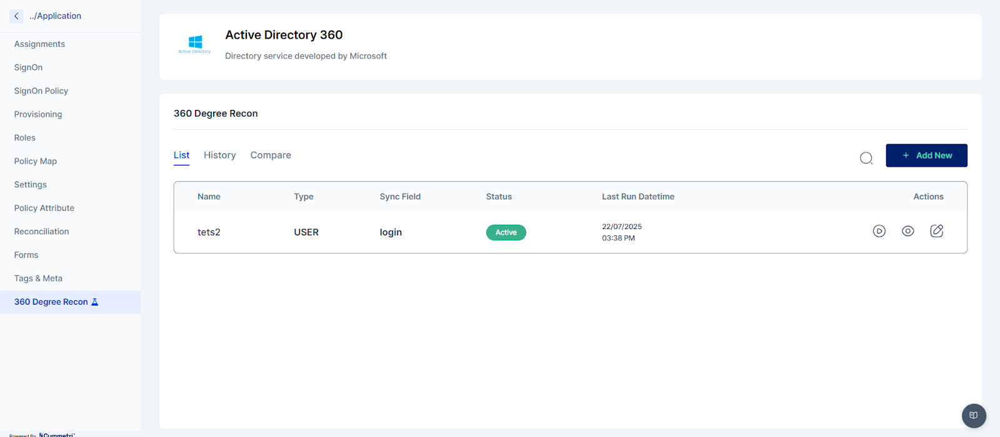

# 360 Generate Comparison Report

Cymmetri’s 360-Degree Reconciliation feature provides a robust solution for ensuring data integrity and consistency across your organization’s identity landscape. This functionality involves pulling user and role information from various applications connected to the Cymmetri platform. This collected data is then compared against your organization's primary Source of Truth (e.g., HRMS) and the Cymmetri identity store.

#### Key Capabilities and Benefits

This feature provides a holistic, 360-degree view of user entitlements, allowing administrators to easily identify and rectify discrepancies. It facilitates several critical reporting and security scenarios, including:

* **Identity Discrepancy Reporting**: The system can generate reports highlighting users who exist in the source application but are not present in the Cymmetri identity store or a target application. This helps identify onboarding failures or synchronization issues.
* **Entitlement Mismatch Analysis**: It provides a comprehensive comparison of user entitlements (roles, permissions, etc.) across multiple applications. This allows for the easy identification of unauthorized access or provisioning errors, such as a user having a role in one application but not in another where it is required, or vice versa.
* **Enhanced Audit and Compliance**: By providing a single, consolidated view of all user entitlements, the feature significantly streamlines audit processes. It ensures that user access aligns with established policies and helps maintain a secure posture by highlighting potential security risks.

The user interface for this feature is organized into three main sections: List, History, and Compare.

#### **List**

This section displays a list of all configured 360-degree reconciliation jobs. It provides high-level information for each job:

* **Name**: The name of the reconciliation job.
* **Type**: Specifies if the reconciliation is for a user or a group.
* **Sync Fields**: The specific attributes used to match records during reconciliation.
* **Status**: Indicates whether the reconciliation job is currently active or inactive.
* **Last Run Datetime**: The timestamp of the last time the job was executed.

<figure><figcaption></figcaption></figure>

#### **History**

The History section shows a log of all previous reconciliation executions. This is where you can see the results of past jobs. It includes:

* **Name**: The name of the reconciliation job.
* **Type**: The type of reconciliation (user or group).
* **Recon Type**: Specifies whether the operation was a PULL (pulling data from a target application) or PUSH (pushing data to a target application).
* **Last Run Datetime**: The timestamp of the execution.
* **Actions**: An icon that provides access to detailed information about a specific reconciliation run.

<figure><figcaption></figcaption></figure>

Clicking the Actions icon reveals more detailed information for that run:

* **Last Start/End Date**: The start and end timestamps of the run.
* **Total Processed Records**: The total number of user records processed.
* **Records Pulled from Target App**: The count of records retrieved from the target application.
* **Present in Target Only**: The number of records that exist in the target system but not in Cymmetri.
* **Present in Cymmetri Only**: The number of records that exist in Cymmetri but not in the target system.
* **Accounts Overdue in the Target**: A count of users whose end date has passed in Cymmetri but are still active in the target application.
* **Breakdown** Type: A consolidated, often visual (e.g., a pie chart), summary of the reconciliation results.
* **User/Application Login**: Login IDs for users in Cymmetri and the target application.
* **Break Type/Comments**: Explanatory comments on the type of reconciliation issues found.
* **Break Count**: The number of reconciliation issues.

<figure><figcaption></figcaption></figure>

Further actions on a specific record can show the user's personal details, such as:

* **Login**: The user's login ID.
* **Display Name**: The user's display name.
* **Email**: The user's registered email.
* **Status**: The user's status (active or inactive).

<figure><figcaption></figcaption></figure>

#### **Compare**

The Compare section allows you to perform a new reconciliation comparison. It presents a list of available comparisons with details similar to the History section. Clicking the Actions icon in this section lets the administrator choose a source for comparison.

<figure><figcaption></figcaption></figure>

Source available:

* **Active users in Cymmetri**: Compares a target application's user data against the active users in Cymmetri's identity store.
* **Other source applications**: Compares data between two different applications.

<figure><figcaption></figcaption></figure>

Upon comparison, an administrator can view the following data:

* **Source Application Login**: This is the user's login ID as it exists in the Source Application—the primary system of record (e.g., HRMS).
* **Target Application Login**: This is the user's login ID as it appears in the Target Application—the secondary system being synchronized.
* **Status**: This indicates whether the user is present in both the source and target systems, highlighting potential discrepancies.

<figure><figcaption></figcaption></figure>
