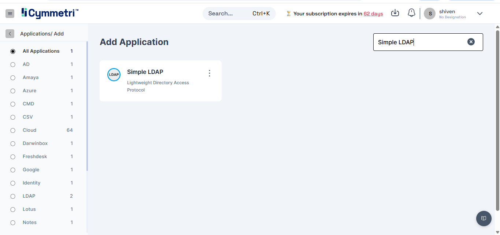
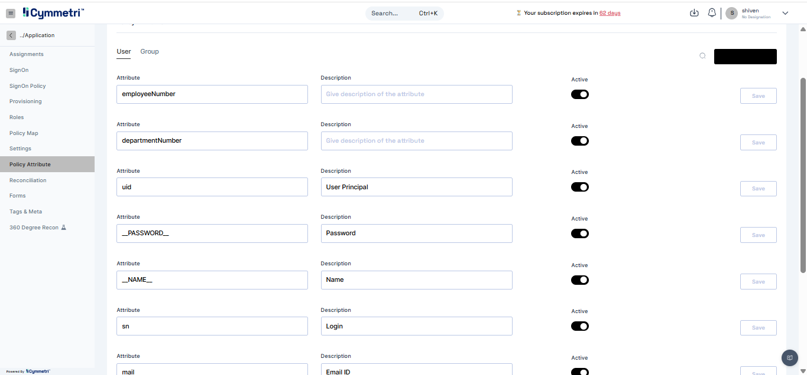
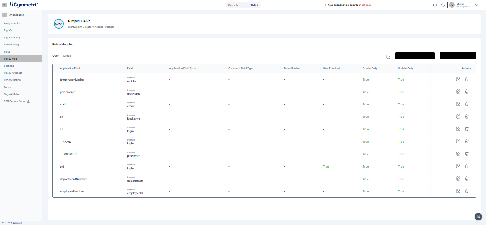
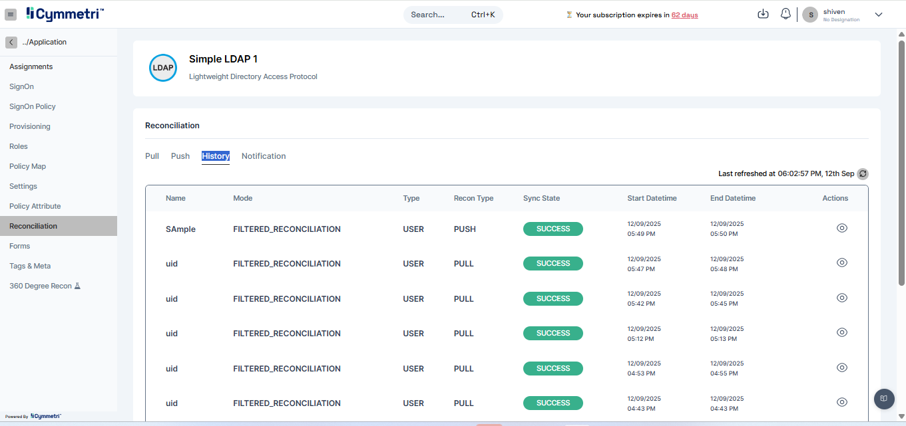
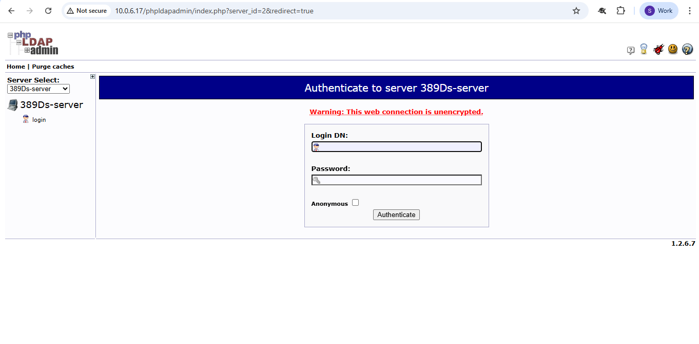
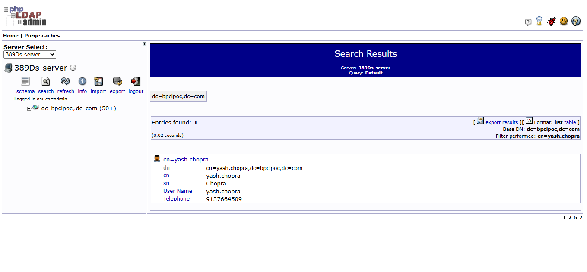

# LDAP Provisioning

LDAP, or Lightweight Directory Access Protocol, is a protocol for accessing and managing directory services over a network. It provides a centralized, hierarchical way to store and authenticate identity-related information like user accounts, groups, and organizational data. This document outlines the formal steps to configure a Simple LDAP application in Cymmetri used for LDAP Provisioning.

#### Prerequisites

Before beginning the configuration, ensure you have the following:

* **LDAP server login credentials**: Specifically, the Bind DN and password.
* **LDAP server access**: To configure and test connections.
* **SSL/TLS certificates**: Required for secure connections using LDAPS (LDAP over SSL). The LDAPS port (typically 636) must be enabled, and the CA certificate must be exported from the LDAP server and imported into the connector server.

### LDAP Essentials

Key information needed for the configuration includes:

* **Server Hostname and Port**: The address of the LDAP server and the port for communication (e.g., 636 for LDAPS).
* **Base DN (Distinguished Name)**: The starting point for all searches within the directory hierarchy (e.g., dc=example,dc=com).
* **OU (Organizational Unit) name**: The name of the specific organizational unit you are targeting.

### Step-by-Step Configuration

#### Step 1: Create a Simple LDAP Application

1. Navigate to Identity Hub → Application.

<figure><figcaption></figcaption></figure>

2. Click Create Application and search for "Simple LDAP."

<figure><figcaption></figcaption></figure>

#### Step 2: Create Policy Map

The policy map defines which attributes are fetched from your LDAP directory.

1. Go to the Policy Attribute section. The table is pre-filled with common LDAP attributes, but you can add  new ones.
   * cn (Common Name): The full name of the user.
   * uid (User ID): A unique user identifier.
   * sn (Surname): The user’s last name.

<figure><figcaption></figcaption></figure>

2. **Standard Attribute Mapping**:

The following mappings are typically used for provisioning:

* telephoneNumber → mobile
* cn → login
* givenName → firstName
* mail → email
* sn → lastName
* cn → firstName

3. Adding New Attributes:

* Click '**Add new**'.
* Enter the attribute name and description, then click Save.

<figure><figcaption></figcaption></figure>

* Toggle the Active switch to enable the new attribute.

<figure><figcaption></figcaption></figure>

#### Step 3: Map Your LDAP to Cymmetri

1. In the same window, go to the Policy Map option.
2. Map each LDAP attribute to its corresponding Cymmetri user attribute. By default, the mapping is set to false and needs to be manually configured.

<figure><figcaption></figcaption></figure>

#### Step 4: Configure User Configuration

This section defines how Cymmetri searches for and interacts with user entries in LDAP.

1. Navigate to User Configuration.
2. Enter the Root Suffixes.

<figure><figcaption></figcaption></figure>

3. Provide the Principal Password.

<figure><figcaption></figcaption></figure>

4. Enter the Base Contexts for group entry searches.

<figure><figcaption></figcaption></figure>

5. Enter the Server HostName.

<figure><figcaption></figcaption></figure>

6. Enter the Principal (the Bind DN)

<figure><figcaption></figcaption></figure>

7. Enter the User Entry Searches.

<figure><figcaption></figcaption></figure>

8. Click Save Configuration and then Test Configuration to verify a successful connection.

<figure><figcaption></figcaption></figure>

#### Step 5: Configure Server Configuration

This section defines the connection parameters for the connector server.

1. Enter the Server Hostname.

<figure><figcaption></figcaption></figure>

2. Enter the Server Password.

<figure><figcaption></figcaption></figure>

3. Enter the Server Port.

<figure><figcaption></figcaption></figure>

4. Enter the Server Connector Bundle Name.

<figure><figcaption></figcaption></figure>

5. Enter the Server Connector Bundle Version.

<figure><figcaption></figcaption></figure>

6. Enter the Server Connector name.

<figure><figcaption></figcaption></figure>

7. Click Save Configuration and then Test Configuration.

<figure><figcaption></figcaption></figure>

**Step 6: Execute Push Reconciliation on LDAP**

1. Click on Reconciliation, select push, and click on add new

<figure><figcaption></figcaption></figure>

2. Configure Push Recon Configuration

<figure><figcaption></figcaption></figure>

3. Click On Run Recon and View in History

<figure><figcaption></figcaption></figure>

<figure><figcaption></figcaption></figure>

4. Click on the View Icon to see the Progress and the result of reconciliation

<figure><figcaption></figcaption></figure>

5. View in Reconciliation History

<figure><figcaption></figcaption></figure>

**Step 7: View Reconciliation Push User in the LDAP Target System**

1. Go to [http://10.0.6.17/phpldapadmin](http://10.0.6.17/phpldapadmin) and enter the required credentials.

<figure><figcaption></figcaption></figure>

2. &#x20;Select the required server

<figure><figcaption></figcaption></figure>

3. Click on search and verify in the search filter by entering its value

<figure><figcaption></figcaption></figure>

<figure><figcaption></figcaption></figure>
