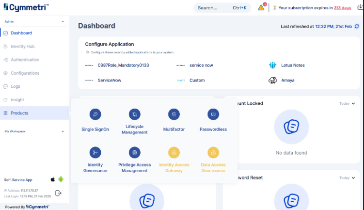
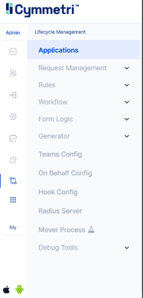
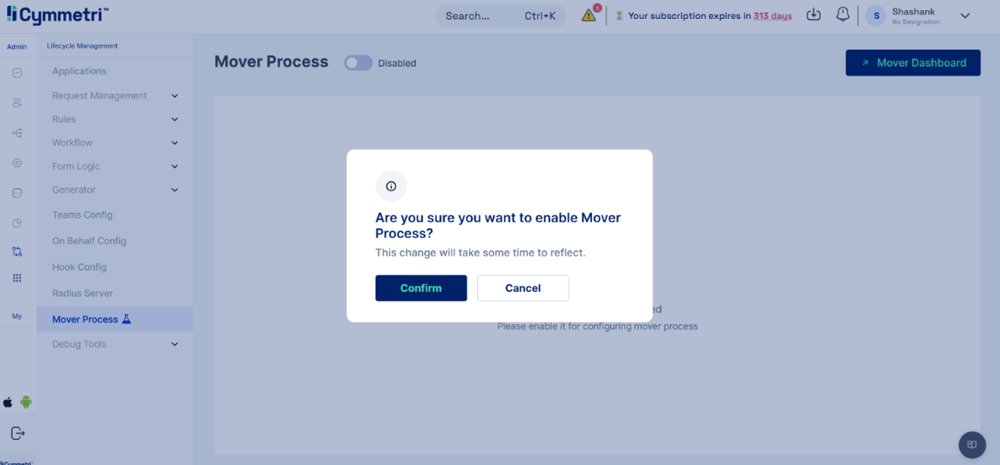

# Mover

The Mover feature, part of the Lifecycle Management module, automates user transitions and access management based on predefined rules. This ensures that user access rights are automatically updated, revoked, or reassigned according to their movement (vertical/lateral) within the organization.&#x20;

Typical Mover use cases include movement across departments/designations/roles. &#x20;

For example, a sales executive promoted to sales manager will require elevated access to CRM.&#x20;

**Mover Dashboard**&#x20;

The Mover Dashboard is a central interface in Lifecycle Management that offers a comprehensive view of user transitions and access changes governed by Mover rules. It assists administrators in monitoring, configuring, and verifying the mover process.&#x20;

Key features of the Mover Dashboard include:&#x20;

* Filtering & Search Options: Allows tracking user transitions using filters such as "Start Date" and "Overlapping Date," and searching for specific users or applications affected.&#x20;
* User Transition Status: Displays users with modified access and their deprovisioning status, indicating which applications will be revoked based on Mover rules.&#x20;
* Audit Logs & Verification: Provides logs to confirm successful Mover triggers and to track when and how user access changes were applied.&#x20;

Steps to Configure Mover:&#x20;

Step 1: Access Mover Feature&#x20;

The Mover feature is located within Lifecycle Management, which is a component of Products in the Cymmetri dashboard.&#x20;

<figure><figcaption></figcaption></figure>

<figure><figcaption></figcaption></figure>

Step 2: Enable Mover Process&#x20;

To enable Mover, click the toggle button. A confirmation prompt will appear; click "Confirm" to proceed. A pop-up message "Mover process config enabled successfully" will confirm activation.&#x20;

<figure><figcaption></figcaption></figure>

<figure><figcaption></figcaption></figure>

Step 3: Configure Mover Process&#x20;

After enabling Mover, configure the process by:&#x20;

* Entering the number of overlapping days.&#x20;
* Add the trigger attribute.&#x20;
* Adding applications to the excluded list. Remember to save configuration.&#x20;

<figure><figcaption></figcaption></figure>

Step 4: Add Provision Rules&#x20;

Once Mover is enabled and configured, add provision rules. Click on "Add New" to begin the configuration process for a new rule.&#x20;

<figure><figcaption></figcaption></figure>

Step 5: Define Provision Rule Details&#x20;

When creating a provision rule:&#x20;

* Provide a name and description for the rules.&#x20;
* Activate the toggle button to enable the rule.&#x20;
* Add the necessary applications and define conditions using the "OR" logic.&#x20;
* Save the configuration to apply the rule.&#x20;

<figure><figcaption></figcaption></figure>

<figure><figcaption></figcaption></figure>

Step 6: Verify Mover Trigger via Identity Hub&#x20;

To verify if Mover is triggered according to the provision rule, update the Identity Hub user:&#x20;

* Navigate to "User" and select "Edit User".&#x20;
* Make the required updates.&#x20;
* Click "Save" to apply the changes.&#x20;

<figure><figcaption></figcaption></figure>

<figure><figcaption></figcaption></figure>

<figure><figcaption></figcaption></figure>

Step 7: Check Audit Logs for Mover Detection

<figure><figcaption></figcaption></figure>

<figure><figcaption></figcaption></figure>

Go to "Logs" and select "Audit Log" to confirm successful Mover detection.

Step 8: Review Deprovisioning Status in Mover Dashboard

<figure><figcaption></figcaption></figure>

In the Mover Dashboard, use the "Filter" option, select the "Start Date" and "Overlapping Date," and click "Apply" to view the status of applications scheduled for deprovisioning
