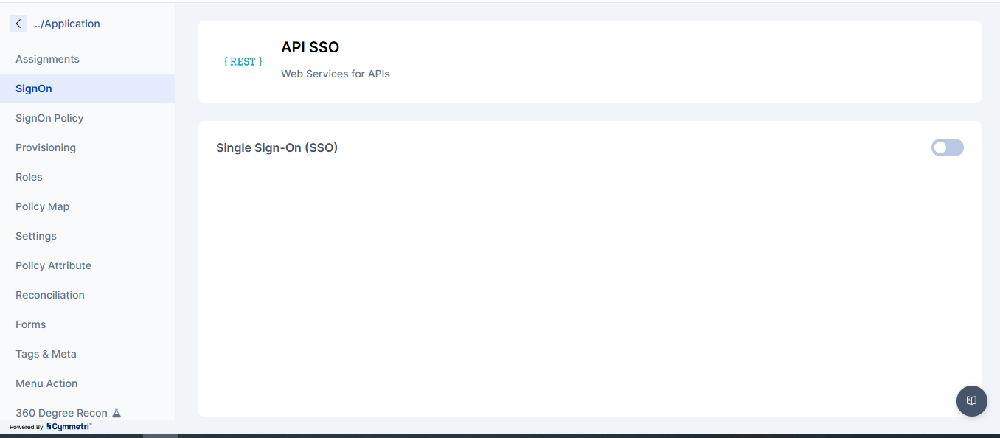

# Sign-On Policies

**Sign-On (MFA) Policies** in Cymmetri Privileged Access Management (PAM) define **when and how Multi-Factor Authentication (MFA) is enforced for privileged users accessing servers** (such as AD servers, Linux servers, databases, or other managed infrastructure).

Server Sign-On policies ensure that:

* Only authorized privileged users can access servers
* Strong authentication is enforced based on risk and identity context
* Access is centrally governed and auditable

### Key Capabilities

* Context-aware MFA enforcement for privileged server access
* Attribute-based access control (ABAC) using user metadata
* Inclusion and exclusion handling for users and groups
* Flexible MFA prompting frequency
* Centralized enforcement across all PAM-managed servers

### Where This Feature Is Used

This policy is evaluated **when a privileged user attempts to access a server** via Cymmetri PAM, including:

* Active Directory servers
* Windows or Linux servers
* Infrastructure accessed through Cymmetri vaulting and PAM workflows

### Policy Configuration Flow

A Server Sign-On (MFA) Policy is configured in **three steps**:

1. **Conditions** – Who the policy applies to
2. **Exclusions** – Who is exempted
3. **Access** – MFA method and frequency

### Step 1: Conditions

**Conditions define the scope of users for whom MFA will be enforced when accessing servers.**

Conditions are evaluated using **user attributes and metadata** synchronized from identity sources (AD, HRMS, IAM directory, etc.).

#### Supported Condition Types

* User attributes (e.g., Designation, Department, Location)
* Metadata attributes
* Group membership
* Logical operators (AND / OR)

#### Example Configuration

| Attribute   | Operator | Value                   |
| ----------- | -------- | ----------------------- |
| Designation | Equal    | Chief Executive Officer |

**Meaning:**

> MFA will be enforced for users whose designation is _Chief Executive Officer_ when they access servers.

<figure><figcaption></figcaption></figure>

#### Logical Grouping

* Multiple conditions can be grouped using **AND / OR**
* Nested condition groups are supported for complex access logic

### Step 2: Exclusions

**Exclusions define users or groups that should not be evaluated against this policy**, even if they meet the conditions.

This is typically used for:

* Emergency access users
* Break-glass accounts
* Automation or service identities

#### Exclusion Options

* **Exclusion Groups** – Select one or more groups
* **Exclusion Users** – Select specific users

#### Example Use Case

* Exclude a _PAM-Emergency-Admins_ group
* Exclude a dedicated _breakglass-admin_ user

<figure><figcaption></figcaption></figure>

### Step 3: Access (MFA Enforcement)

This step defines **how MFA is enforced** for matching users.

<figure><figcaption></figcaption></figure>

#### Authentication Method

Select the MFA mechanism to be used:

* **Cymmetri Authenticator**&#x20;
* **OTP Verification**
* **Push Authenticator**

> This ensures a strong second factor during privileged server access.

#### MFA Prompt Frequency

You can control **how often the user is prompted for MFA**.

| Option             | Description                                 |
| ------------------ | ------------------------------------------- |
| Everytime          | MFA required on every server access attempt |
| Once per session   | MFA required once per login session         |
| Once a day         | MFA required once per calendar day          |
| Once a week        | MFA required once per week                  |
| Once a month       | MFA required once per month                 |
| Once in six months | MFA required once every six months          |
| Only once          | MFA required only on first access           |

#### Security Recommendation

For **high-risk privileged roles**, it is recommended to use:

* **Everytime** or **Once per session**

### Policy Evaluation Logic

When a privileged user attempts to access a server:

1. Cymmetri evaluates **active Server Sign-On policies**
2. Conditions are matched against user attributes
3. Exclusions are applied
4. MFA challenge is enforced as per the access configuration
5. Access is granted only after successful MFA

### Security & Compliance Benefits

* Prevents unauthorized privileged server access
* Enforces Zero Trust for infrastructure
* Reduces risk of credential theft and lateral movement
* Enables compliance with ISO 27001, SOC 2, PCI-DSS, and similar standards
* Provides centralized audit and visibility

### Best Practices

* Apply stricter MFA frequency for Tier-0 and Tier-1 servers
* Use exclusions sparingly and only for emergency scenarios
* Align conditions with HR or IAM-driven attributes
* Regularly review and audit active policies
