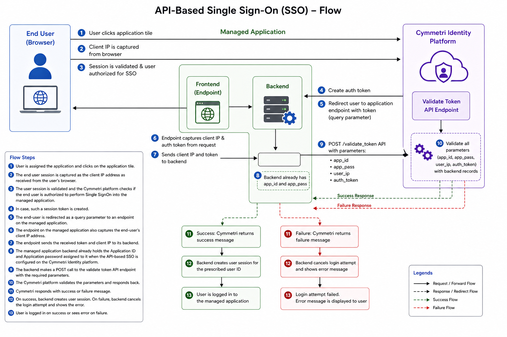
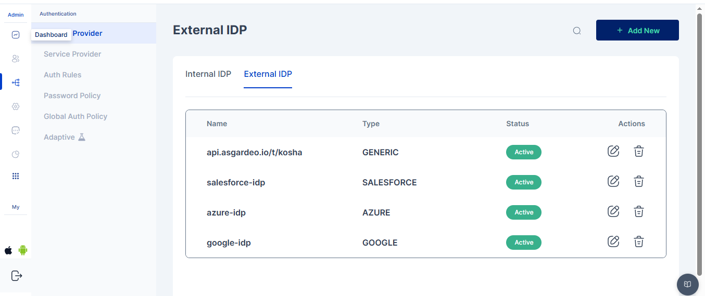

# API Based SSO

Cymmetri platform highly recommends adding support to either SAML 2.0 or OpenID Connect protocols owing to their well-accepted standards and to avoid vendor lock-in.&#x20;

In the absence of the ability of the managed application to adopt either the SAML 2.0 or the OpenID Connect 1.0 standard, the Cymmetri platform provides with the ability to integrate simple REST API based mechanism to allow an end-user to perform Single SignOn from the Cymmetri Identity Portal

## REST API based SSO Explained

<br>

<figure><figcaption></figcaption></figure>

### Flow Description

1. User is assigned the application and clicks on the application tile.
2. The end user session is captured as the client IP address as received from the user’s browser.
3. The user session is validated and the Cymmetri platform checks if the end user is authorized to perform Single SignOn into the managed application.
4. In case, such a session token is created and the end-user is redirected as a query parameter to an endpoint on the managed application.
5. The endpoint on the managed application also captures the end-user’s client IP address, and sends the received token to its backend.
6. The managed application backend already holds the Application ID and Application password assigned to it when the API-based SSO is configured on the Cymmetri Identity platform.&#x20;
7. The managed application backend now makes a POST call to the validate token API endpoint exposed by the Cymmetri Identity platform with the form parameters as follows -&#x20;
   1. app\_id - Previously shared application ID
   2. app\_pass - Previously shared application password
   3. user\_ip - End-user’s client IP address as captured from the end-user’s browser
   4. auth\_token - the token sent to the endpoint of the managed application.
8. The Cymmetri platform responds back with a success message in case the application ID, application password, client IP address and the user session string match with the corresponding records in its backend.
9. In case of success, the managed application is expected to generate a user session for the prescribed user Id as shared in the success response message.
10. The Cymmetri platform responds back with a failure message in case of even one parameter mismatches from among - application ID, application password, client IP address or the user session string (shared token).
11. In case of failure, the managed application is expected to cancel the login attempt and show the error message shared by the Cymmetri Identity platform.

## Configuration for REST API based SSO mechanism

For configuring the REST API based SSO mechanism, first select the application already added into your Cymmetri platform.

Then proceed to the SSO configuration using the “SignOn” link in the left-hand side menu bar.

<figure><figcaption></figcaption></figure>

Enable the Single SignOn by clicking the toggle button on the right-hand side of the page and select API based SSO option.

<figure><figcaption></figcaption></figure>

Now enter the application URL as below -&#x20;

_Application URL = \<base url of the deployment>/apiSSO?applicationId=\<applicationId>_

Let us first copy the URL from the address bar -&#x20;

The corresponding URL in my case is -&#x20;

[https://ssotester.cymmetri.io/identity-hub/application/69f1d4c8515a2826b48c5e03/sign-on](https://ssotester.cymmetri.io/identity-hub/application/69f1d4c8515a2826b48c5e03/sign-on)

We evaluate the following values from the URL -&#x20;

1. Base URL of the deployment - [https://ssotester.cymmetri.io](https://ssotester.cymmetri.io/)
2. applicationId - 69f1d4c8515a2826b48c5e03

Now we generate the Application URL as - [https://ssotester.cymmetri.io/apiSSO?applicationId=69f1d4c8515a2826b48c5e03](https://ssotester.cymmetri.io/apiSSO?applicationId=69f1d4c8515a2826b48c5e03)

Let us enter this value in the Application URL text bar and click the “Save” button.

<figure><figcaption></figcaption></figure>

Now enter all the config information as shown below:&#x20;

<figure><figcaption></figcaption></figure>

### Configuration Parameters

1. Source app token param name - Refers to the key of the query parameter used to share the randomly generated token from the Cymmetri backend.
2. Application Secret - Refers to the parameter app\_pass that must be sent back by the managed application to validate the token.
3. Target App Redirect URL - Refers to the endpoint exposed by the managed application to receive the token as a query parameter.
4. Token Validity - number of seconds for which the generated token is valid. The managed application must send back the token for validation within these many seconds.
5. Target app token param name - This is the field that the managed application must use to send back the token for validation.
6. External Application ID - Refers to the parameter app\_id that must be sent back by the managed application to validate the token.

### Assign the application to a user.

<figure><figcaption></figcaption></figure>

When the application is assigned to the user as shown in the image above, the user can then go and access the applicatiom

On clicking the application tile, the user is redirected to the URL below as per the configuration above.&#x20;

<figure><figcaption></figcaption></figure>

[**http://localhost:8080/getToken**?_auth\_token_=](http://localhost:4124/getToken?auth_token=)\<random token>

Once the token is received by the application, the application makes a POST call as indicated by the CURL request below -&#x20;

curl --location --request POST '[https://ssotester.cymmetri.io/api-sso/api/sso/validateToken](https://ssotester.cymmetri.io/api-sso/api/sso/validateToken)' \\\
\--header 'Content-Type: application/x-www-form-urlencoded' \\\
\--data-urlencode 'app\_id=usermgmt' \\\
\--data-urlencode 'app\_pass=Pa\$$w0rd \\\
\--data-urlencode 'auth\_token=\<random token>' \\\
\--data-urlencode 'user\_ip=\<client IP address>'

Mentioned below is a sample getToken method implemented in the managed application that wishes to use API SSO implementation.\
The url in the api call and the app\_id and app\_pass may vary from tenant to tenant

```
// Sample getToken method implementation in a Spring MVC Application
@RequestMapping("/getToken")
public String getToken(@RequestParam("auth_token") String auth_token, HttpServletRequest req) throws IOException {
	this.auth_token=auth_token;
	String ip=req.getRemoteAddr();
	Properties prop=new Properties();
	boolean allow_user=false;
	
	try (InputStream inputStream = getClass()
			.getClassLoader().getResourceAsStream("App.properties")) {
		
            	prop.load(inputStream);
            	String app_id=prop.getProperty("app_id");
    		String app_pass=prop.getProperty("app_pass");
    		String inputStr="app_id="+app_id+"&app_pass="+app_pass+"&user_session_string="+auth_token+"&user_ip="+ip;
    		String resp=apiCall("https://ssotester.cymmetri.io/api-sso/api/sso/validateToken", inputStr);
    		JSONObject respJSON = new JSONObject(resp);
    		allow_user=respJSON.getBoolean("allow_user");
	} catch (IOException e) {
		e.printStackTrace();
	}	
	
	if(allow_user)
	{
		return "Dashboard";
	}
	else
	{
		return "redirect:/Login.jsp";
	}
}
	
public String apiCall(String urlStr, String inputStr) throws IOException
{
	URL url = new URL(urlStr);

	// Open a connection(?) on the URL(??) and cast the response(???)
	HttpURLConnection connection = (HttpURLConnection) url.openConnection();

	connection.setDoOutput(true);
	connection.setRequestMethod("POST");
	connection.setRequestProperty("Content-Type", "application/x-www-form-urlencoded");
	// Now it's "open", we can set the request method, headers etc.
	connection.setRequestProperty("accept", "application/json");
	
	try(OutputStream os = connection.getOutputStream()) {
	    byte[] input = inputStr.getBytes("utf-8");
	    os.write(input, 0, input.length);			
	}
			
	StringBuilder response = new StringBuilder();
	try(BufferedReader br = new BufferedReader(
		  new InputStreamReader(connection.getInputStream(), "utf-8"))) {
		   
		    String responseLine = null;
		    while ((responseLine = br.readLine()) != null) {
		        response.append(responseLine.trim());
		    }
	}
	
	return response.toString();
}
```

### Response

#### Success Response

```
JSON Response 
{
“status”:”Success”,
“allow_user”:”true”,
“user_id”:”john.doe”
}
```

#### Error Response

```
JSON Response
{
“status”:”User not verified”,
“allow_user”:”false”,
“user_id”:”john.doe”
}
```

In case of this error, “User not verified” message must be shown by the managed application. The user must not be allowed to login.

```
JSON Response
{
“status”:”Application not verified”,
“allow_user”:”false”,
“user_id”:”john.doe”
}
```

In case of this error, “Application not verified” message must be shown by the managed application. The user must not be allowed to login. The application configuration on the Cymmetri Identity platform and the managed application must be validation and cross-verified.


_**Note:**_ If you want a sample application to test API SSO, download the zip file below and follow the steps and ensure you have atleast Java 17 installed:



### Steps to use this sample application as a Managed Application:

* Download the zip file
* Extract in a folder
* Update the properties file as per your tenant name and application id

<figure><figcaption></figcaption></figure>

*   Ensure the users.csv file has entry for your user as shown below:

    <figure><figcaption></figcaption></figure>
* And then run this application locally using the below mentioned java command:

```
java -jar usermgmt-csv-0.0.1-SNAPSHOT.jar --spring.config.location=extcsvapp.properties
```

<figure><figcaption></figcaption></figure>

* If the application is running successfully when the user accesses the app a log showing success or error response can be seen here, as shown below:

<figure><figcaption></figcaption></figure>
